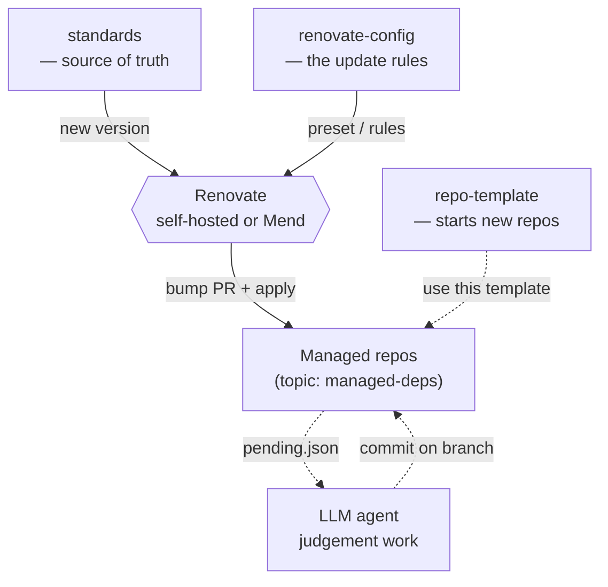

# @sebastian-software/standards

[](https://oss.sebastian-software.com)
[](https://github.com/sebastian-software/standards/actions/workflows/ci.yml)
[](https://opensource.org/licenses/MIT)

The single source of truth for repository standards across the
`sebastian-software` org — reference files, migration changelogs, agent
instructions and a CLI to check and apply them.

## The three repositories

The system is three small repos with sharply separated jobs, plus whatever
Renovate you already run:



- **`standards`** (this repo) — the source of truth: reference files, the
  version stamp, migration changelogs and the CLI. The payload Renovate ships.
- **[`renovate-config`](https://github.com/sebastian-software/renovate-config)** —
  one shared Renovate preset that says _how_ updates behave (what automerges,
  what groups). The only org-specific configuration.
- **[`repo-template`](https://github.com/sebastian-software/repo-template)** —
  the GitHub template new repos start from; it consumes both of the above.

## How it works

Every managed repository carries a `.repometa.json` stamp:

```json
{ "standards": 3, "visibility": "oss", "since": 2026, "platform": "github" }
```

This package defines the current standards version ([manifest.json](manifest.json)),
the reference files per scope (`reference/common`, `reference/node`,
`reference/rust`) and one migration changelog per version bump (`changes/`).
Drift detection is a cheap, deterministic version comparison; applying updates
is split between the CLI (mechanics) and an agent following [SKILL.md](SKILL.md)
(judgement).

## CLI

```bash
standards init    # create .repometa.json interactively in a fresh repo
                  #   --visibility oss|private   skip the prompt for visibility
                  #   --since <int>              skip the prompt for the initial year
                  #   --yes                      non-interactive (use defaults / flags only)
                  #   --force                    overwrite an existing .repometa.json
standards check   # report drift, exit 1 if any (part of agent:check)
standards apply   # write managed files, seed missing ones, update branding, bump stamp
                  #   --from-version <int>    explicit baseline for pending-marker selection
                  #   --emit-pending <path>    write a JSON marker describing pending judgement work
standards sync    # apply + run an agent (claude or codex) locally on the pending changelog entries
```

All managed repositories invoke this package via
`pnpm dlx @sebastian-software/standards`; no devDependency installation is
required, regardless of stack. Every such invocation must carry
`--config.minimum-release-age=0` — pnpm 11 defaults `minimumReleaseAge` to 24h,
so without the bypass `dlx` resolves a version older than the one `apply` used
to write the stamp, and `check` then reports false drift right after a release.

## Renovate-driven workflow

The system is split so that _any_ Renovate setup can keep repos current — the
deterministic half needs no special server features, and the agent half plugs in
where it fits your infrastructure.

**Deterministic half — works with any Renovate, including the hosted Mend app.**
Renovate detects that a repo's `.repometa.json#standards` stamp is behind the
package's `manifest.json#currentVersion` and opens a bump PR. The repo's own CI
runs `standards check` (part of `agent:check`), so drift always surfaces as a red
check. The mechanical sync is `standards apply` — byte-exact for managed files,
seed-once for adaptable ones, marker-based for the README branding.

**Judgement half — an LLM agent.** Changelog steps that need judgement are
carried out by an agent, in one of two ways:

- **Local / interactive:** `standards sync` runs `apply` and then spawns
  `claude` or `codex` on the pending changelog entries. Works anywhere.
- **Fully automated (self-hosted Renovate):** a `postUpgradeTasks` step runs
  `standards apply --from-version {{currentValue}} --emit-pending .standards/pending.json`
  on the upgrade branch. The PR then carries all mechanical changes plus a JSON
  marker that an external agent (OpenClaw, Claude Code, Codex) picks up in pull
  mode and commits its judgement changes onto the same branch.

> [!NOTE]
> The hosted Mend app cannot run `postUpgradeTasks`, so the fully-automated pull
> model requires self-hosted Renovate. With Mend, use the deterministic half plus
> `standards sync` (locally or from a CI job triggered by the bump PR).

The version model is deliberately stack-agnostic: Renovate reads
`manifest.json#currentVersion` as an integer via a custom datasource, so Rust,
docs-only or mixed repos never see an npm semver. See
[`renovate-config`](https://github.com/sebastian-software/renovate-config) for
the shared preset and the self-hosted worker configuration, and
[changes/0002-renovate-pending.md](changes/0002-renovate-pending.md) for the full
server-side contract.

## File ownership

| Kind        | Meaning                                              | Examples                            |
| ----------- | ---------------------------------------------------- | ----------------------------------- |
| **managed** | byte-exact, overwritten on apply                     | `.oxfmtrc.json`, `.oxfmtignore`     |
| **seeded**  | created once, repos may adapt them                   | `eslint.config.ts`, `tsconfig.json` |
| **section** | marker-delimited README block owned by the standards | branding footer                     |

## Development

```bash
pnpm install
pnpm agent:check   # lint + format + typecheck + build + test + self-check
```

This repository applies its own standards (`standards check` runs against it
in CI).

## Onboarding a new repo

The step-by-step procedure for adding a new repo to the standards system
(new repo or legacy migration, GitHub or Forgejo) lives in
[`docs/runbooks/onboard-repo.md`](docs/runbooks/onboard-repo.md).

## License

[MIT](LICENSE)

---

<!-- sebastian-software-branding:start -->
<p align="center">
  <a href="https://oss.sebastian-software.com">
    
  </a>
</p>

<p align="center">
  <strong>Built by Sebastian Software</strong> — consulting for TypeScript, React &amp; Rust.<br />
  <a href="https://sebastian-software.de">Work with us</a> · <a href="https://oss.sebastian-software.com">More open source</a>
</p>

<p align="center">Copyright &copy; 2026 Sebastian Software GmbH</p>
<!-- sebastian-software-branding:end -->
